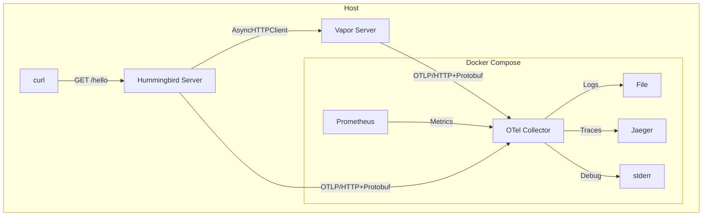

# Hummingbird and Vapor Hello World HTTP Servers with AsyncHTTPClient (OTLP/HTTP+Protobuf)

An HTTP server that uses middleware to emit telemetry for each HTTP request.

> **Disclaimer:** This example is deliberately simplified and is intended for illustrative purposes only.

## Overview

This example contains two HTTP servers, one using Hummingbird and another one using Vapor. Upon receiving a request,
the Hummingbird server calls the Vapor server via `AsyncHTTPClient`. Each server is contained within its own executable,
`HummingbirdServer` and `VaporServer`.
Both executables bootstrap the logging, metrics, and tracing Swift subsystems to export logs, metrics, and traces to
file, Prometheus, and Jaeger, respectively, via an OTel Collector.

They then start the HTTP server along with its associated middleware for instrumentation.

Telemetry data is exported using OTLP/HTTP+Protobuf (the default serialization).

## Package traits

This example package depends on Swift OTel with only the `OTLPHTTP` trait enabled.

This is not strictly necessary because the default traits include both `OTLPHTTP` and `OTLPGRPC`, but it will reduce
 the dependency graph with a new enough Swift toolchain.

To use the OTLP/gRPC exporter, enable the `OTLPGRPC` trait or remove the `traits:` parameter on the package dependency.

## Testing

The example uses [Docker Compose](https://docs.docker.com/compose) to run a set of containers to collect and
visualize the telemetry from the server, which is running on your local machine.



The servers send requests to OTel Collector, which is configured with an OTLP receiver for logs, metrics, and traces;
and exporters for Jaeger, Prometheus and file for traces, metrics, and logs, respectively. The Collector is also
configured with a debug exporter so we can see the events it receives in the container logs.

### Running the collector and visualization containers

In one terminal window, run the following command:

```console
% docker compose -f docker/docker-compose.yaml up
[+] Running 3/3
 ✔ Container docker-jaeger-1          Created                       0.5s
 ✔ Container docker-prometheus-1      Created                       0.4s
 ✔ Container docker-otel-collector-1  Created                       0.5s
...
```

At this point the tracing collector and visualization tools are running.

### Running the Vapor server

Now, in yet another terminal, run the Vapor server locally using the following command:

```console
% swift run VaporServer
```

### Running the Hummingbird server

In another terminal, run the Hummingbird server locally using the following command:

```console
% swift run HummingbirdServer
```

### Making some requests

Finally, in a fourth terminal, make a few requests to the server:

```console
% for i in {1..5}; do curl localhost:8080/hello; done
hello
hello
hello
hello
hello
```

In the output from the OTel Collector, you should see debug messages for the received OTLP events.

### Viewing the log records

The file the OTel Collector is using to export log records is mounted from the host. In another terminal window, you can
watch the logging output using the following command:

```console
% tail -f docker/logs/logs.json
{"resourceLogs":[{"resource":{"attributes":[{"key":"service.name","value":{"stringValue":"vapor"}}]},"scopeLogs":[{"scope":{"name":"swift-otel","version":"1.0.0"},"logRecords":[{"timeUnixNano":"1760372556725656000","observedTimeUnixNano":"1760372556725656000","severityNumber":10,"severityText":"notice","body":{"stringValue":"Server started on http://127.0.0.1:8081"},"attributes":[{"key":"code.line.number","value":{"stringValue":"357"}},{"key":"code.file.path","value":{"stringValue":"Vapor/HTTPServer.swift"}},{"key":"code.function.name","value":{"stringValue":"start(address:)"}}]}]}]}]}

{"resourceLogs":[{"resource":{"attributes":[{"key":"service.name","value":{"stringValue":"hummingbird"}}]},"scopeLogs":[{"scope":{"name":"swift-otel","version":"1.0.0"},"logRecords":[{"timeUnixNano":"1760372613910783000","observedTimeUnixNano":"1760372613910783000","severityNumber":9,"severityText":"info","body":{"stringValue":"Server started and listening on 127.0.0.1:8080"},"attributes":[{"key":"code.function.name","value":{"stringValue":"makeServer(childChannelSetup:configuration:)"}},{"key":"code.line.number","value":{"stringValue":"248"}},{"key":"code.file.path","value":{"stringValue":"HummingbirdCore/Server.swift"}}]}]}]}]}

{"resourceLogs":[{"resource":{"attributes":[{"key":"service.name","value":{"stringValue":"vapor"}}]},"scopeLogs":[{"scope":{"name":"swift-otel","version":"1.0.0"},"logRecords":[{"timeUnixNano":"1760372643327736000","observedTimeUnixNano":"1760372643327736000","severityNumber":9,"severityText":"info","body":{"stringValue":"GET /hello"},"attributes":[{"key":"code.line.number","value":{"stringValue":"14"}},{"key":"code.function.name","value":{"stringValue":"respond(to:chainingTo:)"}},{"key":"code.file.path","value":{"stringValue":"Vapor/RouteLoggingMiddleware.swift"}},{"key":"request-id","value":{"stringValue":"D35DE7A0-F564-40A4-9C65-EDB08C7B4652"}}]},{"timeUnixNano":"1760372643328612000","observedTimeUnixNano":"1760372643328612000","severityNumber":9,"severityText":"info","body":{"stringValue":"GET /hello"},"attributes":[{"key":"code.file.path","value":{"stringValue":"Vapor/RouteLoggingMiddleware.swift"}},{"key":"code.function.name","value":{"stringValue":"respond(to:chainingTo:)"}},{"key":"code.line.number","value":{"stringValue":"14"}},{"key":"request-id","value":{"stringValue":"D35DE7A0-F564-40A4-9C65-EDB08C7B4652"}}],"traceId":"bed981b2d33d0fa7c4314b1759bee6f1","spanId":"6b7b4941c76c2b5b"}]}]}]}
{"resourceLogs":[{"resource":{"attributes":[{"key":"service.name","value":{"stringValue":"hummingbird"}}]},"scopeLogs":[{"scope":{"name":"swift-otel","version":"1.0.0"},"logRecords":[{"timeUnixNano":"1760372642778735000","observedTimeUnixNano":"1760372642778735000","severityNumber":9,"severityText":"info","body":{"stringValue":"Request"},"attributes":[{"key":"code.function.name","value":{"stringValue":"handle(_:context:next:)"}},{"key":"code.line.number","value":{"stringValue":"77"}},{"key":"hb.request.path","value":{"stringValue":"/hello"}},{"key":"hb.request.method","value":{"stringValue":"GET"}},{"key":"code.file.path","value":{"stringValue":"Hummingbird/LogRequestMiddleware.swift"}},{"key":"hb.request.id","value":{"stringValue":"573ec2ae0ae55a63164f64701b2f43b9"}}],"traceId":"bed981b2d33d0fa7c4314b1759bee6f1","spanId":"ba55fe75664334aa"},{"timeUnixNano":"1760372643305520000","observedTimeUnixNano":"1760372643305520000","severityNumber":9,"severityText":"info","body":{"stringValue":"Sending request to Vapor."},"attributes":[{"key":"code.function.name","value":{"stringValue":"main()"}},{"key":"code.line.number","value":{"stringValue":"38"}},{"key":"code.file.path","value":{"stringValue":"HummingbirdServer/HummingbirdServer.swift"}},{"key":"hb.request.id","value":{"stringValue":"573ec2ae0ae55a63164f64701b2f43b9"}}],"traceId":"bed981b2d33d0fa7c4314b1759bee6f1","spanId":"ba55fe75664334aa"}]}]}]}
{"resourceLogs":[{"resource":{"attributes":[{"key":"service.name","value":{"stringValue":"hummingbird"}}]},"scopeLogs":[{"scope":{"name":"swift-otel","version":"1.0.0"},"logRecords":[{"timeUnixNano":"1760372644400078000","observedTimeUnixNano":"1760372644400078000","severityNumber":9,"severityText":"info","body":{"stringValue":"Received response from Vapor."},"attributes":[{"key":"code.line.number","value":{"stringValue":"44"}},{"key":"hb.request.id","value":{"stringValue":"573ec2ae0ae55a63164f64701b2f43b9"}},{"key":"code.function.name","value":{"stringValue":"main()"}},{"key":"code.file.path","value":{"stringValue":"HummingbirdServer/HummingbirdServer.swift"}}],"traceId":"bed981b2d33d0fa7c4314b1759bee6f1","spanId":"ba55fe75664334aa"}]}]}]}
...
```

### Visualizing the metrics using Prometheus UI

Now open the Prometheus UI in your web browser by visiting
[localhost:9090](http://localhost:9090). Click the graph tab and update the
query to `http_server_request_duration_bucket`, or use [this pre-canned
link](http://localhost:9090/graph?g0.expr=http_request_duration_seconds_bucket) for the Vapor server or
[this one](http://localhost:9090/graph?g0.expr=http_server_request_duration_bucket) for the Hummingbird server.

You should see the graph showing the recent request durations.

### Visualizing the traces using Jaeger UI

Visit Jaeger UI in your browser at [localhost:16686](http://localhost:16686).

Select `hummingbird` from the dropdown and click `Find Traces`, or use
[this pre-canned link](http://localhost:16686/search?service=hummingbird).

See the traces for the recent requests and click to select a trace for a given request.

Click to expand the trace, the metadata associated with the request and the
process, and the events.
